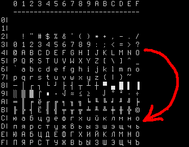
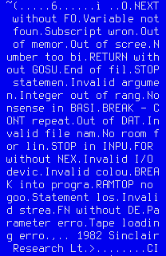

# AND/OR/POPCNT logical operations

## Checking if a value is on 2^n boundary

If you need to check if your value is divisible by 2^n number (like 4096) without remainder,
you can use a *%* operator in C/C++, but there is a simpler way.
4096 is 0x1000, so it always has 4\*3=12 lower bits cleared.

What you need is just:

	if (value&0xFFF)
	{
		printf ("value is not divisible by 0x1000 (or 4096)\n");
		printf ("by the way, remainder is %d\n", value&0xFFF);
	}
	else
		printf ("value is divisible by 0x1000 (or 4096)\n");

In other words, this code checks if there are any bit set among lower 12 bits.
As a side effect, lower 12 bits is always a remainder from division a value by 4096 (because division by 2^n
is merely a right shift, and shifted (and dropped) bits are bits of remainder).

## POPCNT instruction

This is population count (AKA Hamming weight).
It just counts number of bits set in an input value.

As a side effect, POPCNT instruction (or operation) can be used to determine, if the value has 2^n form.
Since, 2^n number always has just one single bit, POPCNT's result will always be just 1.

For example, I once wrote a base64 strings scanner for hunting something interesting in binary files.
And there is a lot of garbage and false positives, so I add an option to filter out data blocks which has size of 2^n bytes
(i.e., 256 bytes, 512, 1024, etc).
The size of block is checked just like this:

	if (popcnt(size)==1)
		// OK

## KOI-8R Cyrillic encoding

It was a time when 8-bit ASCII wasn't supported by some Internet services, including email.
Some supported, some others -- not.

It was also a time, when non-Latin writing systems used second half of 8-bit ASCII table to accommodate non-Latin characters.
There was several popular Cyrillic encodings, but KOI-8R is somewhat unique in comparison with them.

This is a KOI8-R table:

Someone may notice that Cyrillic characters are allocated almost in the same sequence as Latin ones.
This leads to one important property: if all 8th bits in Cyrillic text encoded in KOI-8R are to be reset,
a text transforms into transliterated text with Latin characters in place of Cyrillic.
For example, Russian sentence

	Мой дядя самых честных правил, Когда не в шутку занемог, Он уважать себя заставил И лучше выдумать не мог.

... if encoded in KOI-8R and then 8th bit stripped, transforms into:

	mOJ DQDQ SAMYH ^ESTNYH PRAWIL, kOGDA NE W [UTKU ZANEMOG, oN UWAVATX SEBQ ZASTAWIL i LU^[E WYDUMATX NE MOG.

... probably not very aesthetically appealing, but this text is still readable to Russian language natives.

Hence, Cyrillic text encoded in KOI-8R, passed by broken 7-bit services will survive into transliterated, but still
readable text.

Stripping 8th bit is automatically transposes any character from the second half of
the (any) 8-bit ASCII table to the first one, into the same place (take a look at red arrow right of table).
If the character was already placed in the first half (i.e., it was in standard 7-bit ASCII table), it's not transposed.

Probably, transliterated text is still recoverable, if you'll add 8th bit to the characters which were seems to be
Cyrillic.

Drawback is obvious: Cyrillic characters allocated in KOI-8R table are not in the same sequence as
in Russian/Bulgarian/Ukrainian/etc. alphabet, and this isn't suitable for sorting, for example.

## ZX Spectrum ROM text strings

Those who once investigated ZX Spectrum ROM internals, probably notices that the last symbol of each text string is seemingly
absent.

There are present, in fact.

Here is excerpt of ZX Spectrum 128K ROM disassembled:

	L048C:  DEFM "MERGE erro"                  ; Report 'a'.
        	DEFB 'r'+$80
	L0497:  DEFM "Wrong file typ"              ; Report 'b'.
        	DEFB 'e'+$80
	L04A6:  DEFM "CODE erro"                   ; Report 'c'.
        	DEFB 'r'+$80
	L04B0:  DEFM "Too many bracket"            ; Report 'd'.
        	DEFB 's'+$80
	L04C1:  DEFM "File already exist"          ; Report 'e'.
        	DEFB 's'+$80
( [src](http://www.matthew-wilson.net/spectrum/rom/128_ROM0.html) )

Last character has most significant bit set, which marks string end.
Presumably, it was done to save some space?
Old 8-bit computers has very tight environment.

Characters of all messages are always in standard ASCII table, so it's guaranteed 8th bit is never used for characters.

To print such string, we need to check MSB of each byte, and if it's set, we need to clear it, then print character,
and then stop.
Here is a C example:

	unsigned char hw[]=
	{
		'H',
		'e',
		'l',
		'l',
		'o'|0x80
	};

	void print_string()
	{
		for (int i=0; ;i++)
		{
			if (hw[i]&0x80) // check for MSB
			{
				// clear MSB
				// (in other words, clear all, but leave 7 lower bits intact)
				printf ("%c", hw[i] & 0x7F);
				// stop
				break;
			};
			printf ("%c", hw[i]);
		};
	};

Now what is interesting, since 8th bit is the most significant bit, we can check it, set it and remove it using
arithmetical operations instead of logical.

I can rewrite my C example:

	unsigned char hw[]=
	{
		'H',
		'e',
		'l',
		'l',
		'o'+0x80
	};

	void print()
	{
		for (int i=0; ;i++)
		{
			// hw[] must have 'unsigned char' type
			if (hw[i] >= 0x80) // check for MSB
			{
				printf ("%c", hw[i]-0x80); // clear MSB
				// stop
				break;
			};
			printf ("%c", hw[i]);
		};
	};

*char* is signed type in C/C++, so to compare it with variable like 0x80 (which is negative (-128) if treated as signed),
we need to treat each character in text message as unsigned.

Now if 8th bit is set, the number is always larger or equal to 0x80.
If 8th bit is clear, the number is always smaller than 0x80.

Even more than that: if 8th bit is set, it can be cleared by subtracting 0x80, nothing else.
If it's not set, however, subtracting will destruct other bits.

Likewise, if 8th bit is clear, it's possible to set it by adding 0x80.
But if it's set, addition operation will destruct some other bits.

In fact, this is valid for any bit.
If the 4th bit is clear, you can set it just by adding 0x10: 0x100+0x10 = 0x110.
If the 4th bit is set, you can clear it by subtracting 0x10: 0x1234-0x10 = 0x1224.

It works, because carry isn't happened during addition/subtraction.
It will, however, happen, if the bit is already set there before addition, or absent before subtraction.

Likewise, addition/subtraction can be replaced using OR/AND operation if two conditions are met:
1) you need to add/subtract by a number in form of 2^n;
2) this bit in source value is clear/set.

For example, addition of 0x20 is the same as ORing value with 0x20 under condition that this bit is clear before:
0x1204|0x20 = 0x1204+0x20 = 0x1224.

Subtraction of 0x20 is the same as ANDing value with ~0x20 (0x..FFDF), but if this bit is set before:
0x1234&(~0x20) = 0x1234&0xFFDF = 0x1234-0x20 = 0x1214.

Again, it works because carry not happened when you add 2^n number and this bit isn't set before.

This property of boolean logic is important, worth understanding and keeping it in mind.
Sometimes, compiler optimizations uses this, [for example](https://github.com/dennis714/RE-for-beginners/blob/1e35933e1a9f9ca373730e37b8da99085d3faeec/advanced/200_string_trim/x64.tex).

