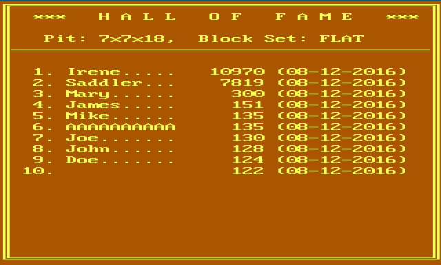
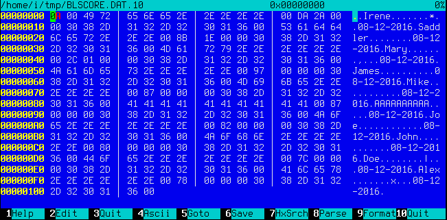
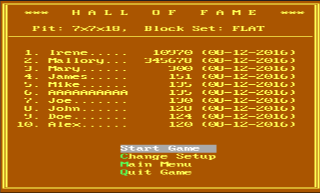
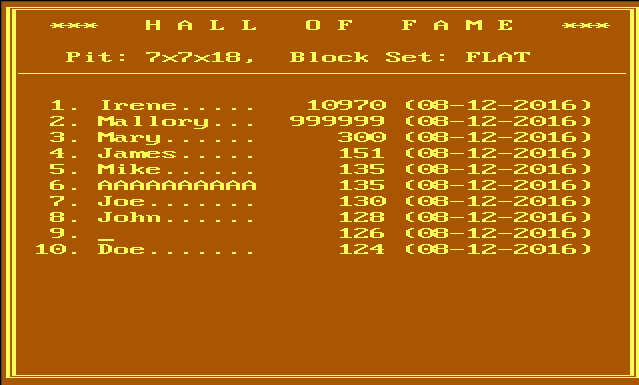
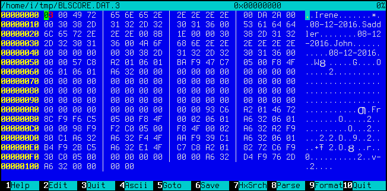

# High-score file in "Block out" game and primitive serialization

Many videogames has high-score file, sometimes called "Hall of fame".
Ancient [Block out](http://www.bestoldgames.net/eng/old-games/blockout.php) game (3D tetris from 1989) isn't exception, here is what we see at the end:

Now we can see that the file has changed after we added our name is *BLSCORE.DAT*.
Let's take a look on it in Midnight Commander:

All entries are clearly visible.
The very first byte is probably number of entries.
Second is zero and, in fact, number of entries can be 16-bit value spanning over first two bytes.

Next, after "Irene" name we see 0xDA and 0x2A bytes.
Irene has score 10970, and this is exactly 0x2ADA in hexadecimal radix.
So high score value is probably 16-bit integer, or maybe 32-bit integer: there are two more zero bytes after.

Now let's think about the fact that both array elements and structure elements are always placed in memory in adjacently to each other.
That enables us to write the whole array/structure to the file using simple *write()* or *fwrite()* function, 
and then restore it using *read()* or *fread()*, as simple as that.
This is what is called *serialization* nowadays.

## Read

Now let's write C program to read highscore file:

	#include <assert.h>
	#include <stdio.h>
	#include <stdint.h>
	#include <string.h>

	struct entry
	{
		char name[11]; // incl. terminating zero
		uint32_t score;
		char date[11]; // incl. terminating zero
	} __attribute__ ((aligned (1),packed));

	struct highscore_file
	{
		uint8_t count;
		uint8_t unknown;
		struct entry entries[10];
	} __attribute__ ((aligned (1), packed));

	struct highscore_file file;

	int main(int argc, char* argv[])
	{
		FILE* f=fopen(argv[1], "rb");
		assert (f!=NULL);
		size_t got=fread(&file, 1, sizeof(struct highscore_file), f);
		assert (got==sizeof(struct highscore_file));
		fclose(f);
		for (int i=0; i<file.count; i++)
		{
			printf ("name=%s score=%d date=%s\n",
					file.entries[i].name,
					file.entries[i].score,
					file.entries[i].date);
		};
	};

We need GCC *((aligned (1),packed))* attribute so that all structure fields will be packed on 1-byte boundary.

Of course it works:

	name=Irene..... score=10970 date=08-12-2016
	name=Saddler... score=7819 date=08-12-2016
	name=Mary...... score=300 date=08-12-2016
	name=James..... score=151 date=08-12-2016
	name=Mike...... score=135 date=08-12-2016
	name=AAAAAAAAAA score=135 date=08-12-2016
	name=Joe....... score=130 date=08-12-2016
	name=John...... score=128 date=08-12-2016
	name=Doe....... score=124 date=08-12-2016
	name=Alex...... score=120 date=08-12-2016

(Needless to say, each name is padded with dots, both on screen and in the file, perhaps, for aesthetical reasons.)

## Write

Let's check if we right about width of score value. Is it really has 32 bits?

	int main(int argc, char* argv[])
	{
		FILE* f=fopen(argv[1], "rb");
		assert (f!=NULL);
		size_t got=fread(&file, 1, sizeof(struct highscore_file), f);
		assert (got==sizeof(struct highscore_file));
		fclose(f);
	
		strcpy (file.entries[1].name, "Mallory...");
		file.entries[1].score=12345678;
		strcpy (file.entries[1].date, "08-12-2016");
	
		f=fopen(argv[1], "wb");
		assert (f!=NULL);
		got=fwrite(&file, 1, sizeof(struct highscore_file), f);
		assert (got==sizeof(struct highscore_file));
		fclose(f);
	};

Let's run Blockout:

First two digits (1 or 2) are choked. Perhaps, this is formatting issues... but the number is almost correct.
Now I'm changing it to 999999 and run again:

Now it's correct. Yes, high score value is 32-bit integer.

## Is it serialization?

... almost.
Serialization like this is highly popular in scientific software, where efficiency and speed is much more important
than converting into XML and back.

One important thing is that you obviously cannot serialize pointers, because each time you load the file into memory,
all the structures may be allocated in different places.

But: if you work on some kind of low-cost MCU with simple OS and you have your structures allocated at always same
places in memory, you probably can save and restore pointers as well.

## Random noise

When I prepared this example, I had to run *Block out* many times and played for it a bit
to fill high-score table with random names.

And when there were just 3 entries in the file, I saw this:

The first byte has value of 3, meaning there are 3 entries.
And there are 3 entries present.
But then we see a random noise at the second half of file.

The noise is probably has its origin in uninitialized data.
Perhaps, *Block out* allocated memory for 10 entries somewhere in heap, where, obviously,
some pseudorandom noise (left from something else) was present.
Then it set first/second byte, fill 3 entries, and then it never touched 7 entries left, so they are written
to the file as is.

When *Block out* loads high score file at the next run, it reads number of entries from the first/second byte (3) and
then completely ignores what is after it.

This is common problem.

Microsoft Word versions from 1990s has been often left pieces of previously edited texts into the *.doc* files.
It was some kind of amusement back then, to get a *.doc* file from someone,
then open it in a hexadecimal editor and read something else,
what has been edited on that computer before.

The problem can be even much more serious: [Heartbleed bug](https://en.wikipedia.org/wiki/Heartbleed) in OpenSSL.

## Homework

*Block out* has several polycubes (flat/basic/extended), size of pit can be configured, etc.
And it seems, for each configuration, *Block out* has its own high score table.
I've notices that some information is probably stored in *BLSCORE.IDX* file.
This can be a homework for hardcore *Block out* fans - to understand its structure as well.

The *Block out* files are [here](http://beginners.re/examples/blockout.zip) (including the binary high score files
I've used in this example).
You can use DosBox to run it.

