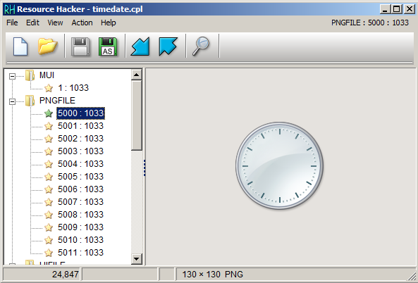
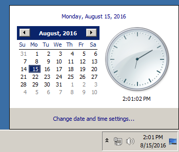
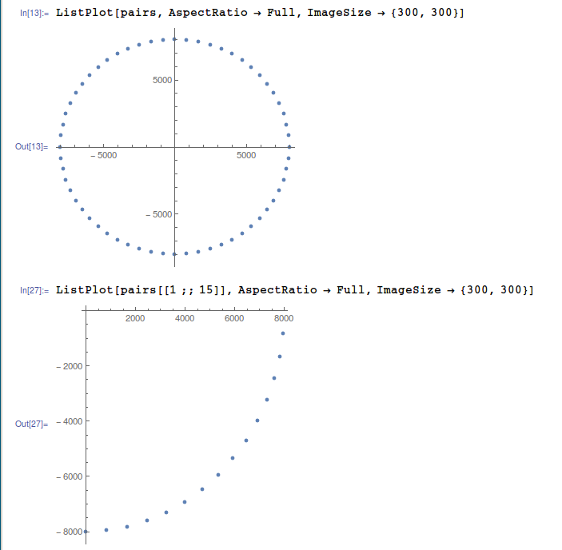
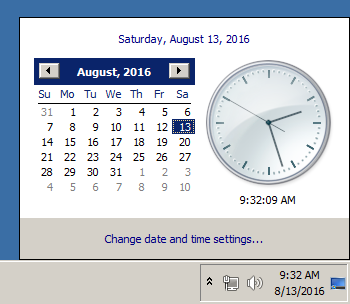

# Hacking Windows clock

I've always wanted to do some kind of 1-April prank for my coworkers.
Let's find, if we could do something with Windows clock?
Can we force to go clock hands backwards?

First of all, when you click on date/time in status bar, a *C:\WINDOWS\SYSTEM32\TIMEDATE.CPL* is running,
which is usual executable PE file.

Let's see, how it draw hands?
When I open the file (from Windows 7) in Resource Hacker, there are clock faces, but with no hands:

OK, what we know? How to draw a clock hand? All they are started at the middle of circle, ending with its border.
Hence, we need to calculate coordinates of circle.
From school-level mathematics we may remember that we need to use sine/cosine functions to draw circle, or at least
square root.
There are no such things in TIMEDATE.CPL, at least at first glance.
But, thanks to Microsoft debugging PDB files, I can find a function named *CAnalogClock::DrawHand()*, which calls
*Gdiplus::Graphics::DrawLine()* at least twice.

Here is its code:

	.text:6EB9DBC7 ; private: enum  Gdiplus::Status __thiscall CAnalogClock::_DrawHand(class Gdiplus::Graphics *, int, struct ClockHand const &, class Gdiplus::Pen *)
	.text:6EB9DBC7 ?_DrawHand@CAnalogClock@@AAE?AW4Status@Gdiplus@@PAVGraphics@3@HABUClockHand@@PAVPen@3@@Z proc near
	.text:6EB9DBC7                                         ; CODE XREF: CAnalogClock::_ClockPaint(HDC__ *)+163p
	.text:6EB9DBC7                                         ; CAnalogClock::_ClockPaint(HDC__ *)+18Bp ...
	.text:6EB9DBC7
	.text:6EB9DBC7 var_10          = dword ptr -10h
	.text:6EB9DBC7 var_C           = dword ptr -0Ch
	.text:6EB9DBC7 var_8           = dword ptr -8
	.text:6EB9DBC7 var_4           = dword ptr -4
	.text:6EB9DBC7 arg_0           = dword ptr  8
	.text:6EB9DBC7 arg_4           = dword ptr  0Ch
	.text:6EB9DBC7 arg_8           = dword ptr  10h
	.text:6EB9DBC7 arg_C           = dword ptr  14h
	.text:6EB9DBC7
	.text:6EB9DBC7                 mov     edi, edi
	.text:6EB9DBC9                 push    ebp
	.text:6EB9DBCA                 mov     ebp, esp
	.text:6EB9DBCC                 sub     esp, 10h
	.text:6EB9DBCF                 mov     eax, [ebp+arg_4]
	.text:6EB9DBD2                 push    ebx
	.text:6EB9DBD3                 push    esi
	.text:6EB9DBD4                 push    edi
	.text:6EB9DBD5                 cdq
	.text:6EB9DBD6                 push    3Ch
	.text:6EB9DBD8                 mov     esi, ecx
	.text:6EB9DBDA                 pop     ecx
	.text:6EB9DBDB                 idiv    ecx
	.text:6EB9DBDD                 push    2
	.text:6EB9DBDF                 lea     ebx, table[edx*8]
	.text:6EB9DBE6                 lea     eax, [edx+1Eh]
	.text:6EB9DBE9                 cdq
	.text:6EB9DBEA                 idiv    ecx
	.text:6EB9DBEC                 mov     ecx, [ebp+arg_0]
	.text:6EB9DBEF                 mov     [ebp+var_4], ebx
	.text:6EB9DBF2                 lea     eax, table[edx*8]
	.text:6EB9DBF9                 mov     [ebp+arg_4], eax
	.text:6EB9DBFC                 call    ?SetInterpolationMode@Graphics@Gdiplus@@QAE?AW4Status@2@W4InterpolationMode@2@@Z ; Gdiplus::Graphics::SetInterpolationMode(Gdiplus::InterpolationMode)
	.text:6EB9DC01                 mov     eax, [esi+70h]
	.text:6EB9DC04                 mov     edi, [ebp+arg_8]
	.text:6EB9DC07                 mov     [ebp+var_10], eax
	.text:6EB9DC0A                 mov     eax, [esi+74h]
	.text:6EB9DC0D                 mov     [ebp+var_C], eax
	.text:6EB9DC10                 mov     eax, [edi]
	.text:6EB9DC12                 sub     eax, [edi+8]
	.text:6EB9DC15                 push    8000            ; nDenominator
	.text:6EB9DC1A                 push    eax             ; nNumerator
	.text:6EB9DC1B                 push    dword ptr [ebx+4] ; nNumber
	.text:6EB9DC1E                 mov     ebx, ds:__imp__MulDiv@12 ; MulDiv(x,x,x)
	.text:6EB9DC24                 call    ebx ; MulDiv(x,x,x) ; MulDiv(x,x,x)
	.text:6EB9DC26                 add     eax, [esi+74h]
	.text:6EB9DC29                 push    8000            ; nDenominator
	.text:6EB9DC2E                 mov     [ebp+arg_8], eax
	.text:6EB9DC31                 mov     eax, [edi]
	.text:6EB9DC33                 sub     eax, [edi+8]
	.text:6EB9DC36                 push    eax             ; nNumerator
	.text:6EB9DC37                 mov     eax, [ebp+var_4]
	.text:6EB9DC3A                 push    dword ptr [eax] ; nNumber
	.text:6EB9DC3C                 call    ebx ; MulDiv(x,x,x) ; MulDiv(x,x,x)
	.text:6EB9DC3E                 add     eax, [esi+70h]
	.text:6EB9DC41                 mov     ecx, [ebp+arg_0]
	.text:6EB9DC44                 mov     [ebp+var_8], eax
	.text:6EB9DC47                 mov     eax, [ebp+arg_8]
	.text:6EB9DC4A                 mov     [ebp+var_4], eax
	.text:6EB9DC4D                 lea     eax, [ebp+var_8]
	.text:6EB9DC50                 push    eax
	.text:6EB9DC51                 lea     eax, [ebp+var_10]
	.text:6EB9DC54                 push    eax
	.text:6EB9DC55                 push    [ebp+arg_C]
	.text:6EB9DC58                 call    ?DrawLine@Graphics@Gdiplus@@QAE?AW4Status@2@PBVPen@2@ABVPoint@2@1@Z ; Gdiplus::Graphics::DrawLine(Gdiplus::Pen const *,Gdiplus::Point const &,Gdiplus::Point const &)
	.text:6EB9DC5D                 mov     ecx, [edi+8]
	.text:6EB9DC60                 test    ecx, ecx
	.text:6EB9DC62                 jbe     short loc_6EB9DCAA
	.text:6EB9DC64                 test    eax, eax
	.text:6EB9DC66                 jnz     short loc_6EB9DCAA
	.text:6EB9DC68                 mov     eax, [ebp+arg_4]
	.text:6EB9DC6B                 push    8000            ; nDenominator
	.text:6EB9DC70                 push    ecx             ; nNumerator
	.text:6EB9DC71                 push    dword ptr [eax+4] ; nNumber
	.text:6EB9DC74                 call    ebx ; MulDiv(x,x,x) ; MulDiv(x,x,x)
	.text:6EB9DC76                 add     eax, [esi+74h]
	.text:6EB9DC79                 push    8000            ; nDenominator
	.text:6EB9DC7E                 push    dword ptr [edi+8] ; nNumerator
	.text:6EB9DC81                 mov     [ebp+arg_8], eax
	.text:6EB9DC84                 mov     eax, [ebp+arg_4]
	.text:6EB9DC87                 push    dword ptr [eax] ; nNumber
	.text:6EB9DC89                 call    ebx ; MulDiv(x,x,x) ; MulDiv(x,x,x)
	.text:6EB9DC8B                 add     eax, [esi+70h]
	.text:6EB9DC8E                 mov     ecx, [ebp+arg_0]
	.text:6EB9DC91                 mov     [ebp+var_8], eax
	.text:6EB9DC94                 mov     eax, [ebp+arg_8]
	.text:6EB9DC97                 mov     [ebp+var_4], eax
	.text:6EB9DC9A                 lea     eax, [ebp+var_8]
	.text:6EB9DC9D                 push    eax
	.text:6EB9DC9E                 lea     eax, [ebp+var_10]
	.text:6EB9DCA1                 push    eax
	.text:6EB9DCA2                 push    [ebp+arg_C]
	.text:6EB9DCA5                 call    ?DrawLine@Graphics@Gdiplus@@QAE?AW4Status@2@PBVPen@2@ABVPoint@2@1@Z ; Gdiplus::Graphics::DrawLine(Gdiplus::Pen const *,Gdiplus::Point const &,Gdiplus::Point const &)
	.text:6EB9DCAA
	.text:6EB9DCAA loc_6EB9DCAA:                           ; CODE XREF: CAnalogClock::_DrawHand(Gdiplus::Graphics *,int,ClockHand const &,Gdiplus::Pen *)+9Bj
	.text:6EB9DCAA                                         ; CAnalogClock::_DrawHand(Gdiplus::Graphics *,int,ClockHand const &,Gdiplus::Pen *)+9Fj
	.text:6EB9DCAA                 pop     edi
	.text:6EB9DCAB                 pop     esi
	.text:6EB9DCAC                 pop     ebx
	.text:6EB9DCAD                 leave
	.text:6EB9DCAE                 retn    10h
	.text:6EB9DCAE ?_DrawHand@CAnalogClock@@AAE?AW4Status@Gdiplus@@PAVGraphics@3@HABUClockHand@@PAVPen@3@@Z endp
	.text:6EB9DCAE
	
We can see that DrawLine() arguments are dependent on result of MulDiv() function and a *table[]* table (name is mine),
which has 8-byte elements (look at LEA's second operand).

What is inside of table[]?

	.text:6EB87890 ; int table[]
	.text:6EB87890 table           dd 0
	.text:6EB87894                 dd 0FFFFE0C1h
	.text:6EB87898                 dd 344h
	.text:6EB8789C                 dd 0FFFFE0ECh
	.text:6EB878A0                 dd 67Fh
	.text:6EB878A4                 dd 0FFFFE16Fh
	.text:6EB878A8                 dd 9A8h
	.text:6EB878AC                 dd 0FFFFE248h
	.text:6EB878B0                 dd 0CB5h
	.text:6EB878B4                 dd 0FFFFE374h
	.text:6EB878B8                 dd 0F9Fh
	.text:6EB878BC                 dd 0FFFFE4F0h
	.text:6EB878C0                 dd 125Eh
	.text:6EB878C4                 dd 0FFFFE6B8h
	.text:6EB878C8                 dd 14E9h
	...

It's referenced only from *DrawHand()* function at has 120 32-bit words or 60 32-bit pairs... wait, 60?
Let's take a closer look at these values.
First of all, I'll zap 6 pairs or 12 32-bit words with zeroes, and then I'll put patched TIMEDATE.CPL
into C:\WINDOWS\SYSTEM32.
(You may need to set owner of the TIMEDATE.CPL file to your primary user account, and also, boot in safe mode with command
prompt so you can copy the file, which is usually locked.)

Now when any hand is located at 0-5 seconds/minutes, it's invisible! However, opposite (shorter) part of second hand
is visible and moving.
When any hand is outside of this area, hand is visible as usual.

Let's take even closer look at the table in Mathematica.
I copypasted table from the TIMEDATE.CPL to a *tbl* file (480 bytes).
We will take for granted the fact that these are signed values, because half of elements are below zero (0FFFFE0C1h, etc).
If these values would be unsigned, they would be suspiciously huge.

	In[]:= tbl = BinaryReadList["~/.../tbl", "Integer32"]

	Out[]= {0, -7999, 836, -7956, 1663, -7825, 2472, -7608, 3253, -7308, 3999, \
	-6928, 4702, -6472, 5353, -5945, 5945, -5353, 6472, -4702, 6928, \
	-4000, 7308, -3253, 7608, -2472, 7825, -1663, 7956, -836, 8000, 0, \
	7956, 836, 7825, 1663, 7608, 2472, 7308, 3253, 6928, 4000, 6472, \
	4702, 5945, 5353, 5353, 5945, 4702, 6472, 3999, 6928, 3253, 7308, \
	2472, 7608, 1663, 7825, 836, 7956, 0, 7999, -836, 7956, -1663, 7825, \
	-2472, 7608, -3253, 7308, -4000, 6928, -4702, 6472, -5353, 5945, \
	-5945, 5353, -6472, 4702, -6928, 3999, -7308, 3253, -7608, 2472, \
	-7825, 1663, -7956, 836, -7999, 0, -7956, -836, -7825, -1663, -7608, \
	-2472, -7308, -3253, -6928, -4000, -6472, -4702, -5945, -5353, -5353, \
	-5945, -4702, -6472, -3999, -6928, -3253, -7308, -2472, -7608, -1663, \
	-7825, -836, -7956}

	In[]:= Length[tbl]
	Out[]= 120

Let's treat two consecutive 32-bit values as pair:

	In[]:= pairs = Partition[tbl, 2]
	Out[]= {{0, -7999}, {836, -7956}, {1663, -7825}, {2472, -7608}, \
	{3253, -7308}, {3999, -6928}, {4702, -6472}, {5353, -5945}, {5945, \
	-5353}, {6472, -4702}, {6928, -4000}, {7308, -3253}, {7608, -2472}, \
	{7825, -1663}, {7956, -836}, {8000, 0}, {7956, 836}, {7825, 
	1663}, {7608, 2472}, {7308, 3253}, {6928, 4000}, {6472, 
	4702}, {5945, 5353}, {5353, 5945}, {4702, 6472}, {3999, 
	6928}, {3253, 7308}, {2472, 7608}, {1663, 7825}, {836, 7956}, {0, 
	7999}, {-836, 7956}, {-1663, 7825}, {-2472, 7608}, {-3253, 
	7308}, {-4000, 6928}, {-4702, 6472}, {-5353, 5945}, {-5945, 
	5353}, {-6472, 4702}, {-6928, 3999}, {-7308, 3253}, {-7608, 
	2472}, {-7825, 1663}, {-7956, 836}, {-7999, 
	0}, {-7956, -836}, {-7825, -1663}, {-7608, -2472}, {-7308, -3253}, \
	{-6928, -4000}, {-6472, -4702}, {-5945, -5353}, {-5353, -5945}, \
	{-4702, -6472}, {-3999, -6928}, {-3253, -7308}, {-2472, -7608}, \
	{-1663, -7825}, {-836, -7956}}

	In[]:= Length[pairs]
	Out[]= 60

Let's try to treat each pair as X/Y coordinate and draw all 60 pairs, and also first 15 pairs:

Now this is something!
Each pair is just coordinate.
First 15 pairs are coordinates for 1/4 of circle.

Perhaps, Microsoft developers precalculated all coordinates and put them into table.

Now I can understand why when I zapped 6 pairs, hands were invisible at that area: in fact, hands were drawed,
they just had zero length, because hand started at 0:0 coordinate and ended there.

## The prank (practical joke)

Given all that, how would we force hands to go counterclockwise?
In fact, this is simple, we need just to rotate the table, so each hand, instead of drawing at place of first second,
would be drawing at place of 59th second.

I made the patcher a long time ago, at the very beginning of 2000s, for Windows 2000.
Hard to believe, it still works for Windows 7, perhaps, the table hasn't been changed since then!

URL

Now I can see all hands goes backwards:

Well, there is no animation in this article, but if you look closer, you can see, that hands are in fact shows correct
time, but the whole clock face is rotated vertically, like we see it from the inside of clock.

## Windows 2000 leaked source code

So I did the patcher and then Windows 2000 source code has been leaked (I can't force you to trust me, though).
Let's take a look on source code if that function and table.
The file is *win2k/private/shell/cpls/utc/clock.c*:

	//
	//  Array containing the sine and cosine values for hand positions.
	//
	POINT rCircleTable[] =
	{
	    { 0,     -7999},
	    { 836,   -7956},
	    { 1663,  -7825},
	    { 2472,  -7608},
	    { 3253,  -7308},
	...
	    { -4702, -6472},
	    { -3999, -6928},
	    { -3253, -7308},
	    { -2472, -7608},
	    { -1663, -7825},
	    { -836 , -7956},
	};

	////////////////////////////////////////////////////////////////////////////
	//
	//  DrawHand
	//
	//  Draws the hands of the clock.
	//
	////////////////////////////////////////////////////////////////////////////

	void DrawHand(
	    HDC hDC,
	    int pos,
	    HPEN hPen,
	    int scale,
	    int patMode,
	    PCLOCKSTR np)
	{
	    LPPOINT lppt;
	    int radius;

	    MoveTo(hDC, np->clockCenter.x, np->clockCenter.y);
	    radius = MulDiv(np->clockRadius, scale, 100);
	    lppt = rCircleTable + pos;
	    SetROP2(hDC, patMode);
	    SelectObject(hDC, hPen);

	    LineTo( hDC,
	            np->clockCenter.x + MulDiv(lppt->x, radius, 8000),
	            np->clockCenter.y + MulDiv(lppt->y, radius, 8000) );
	}

Now it's clear: coordinates has been precalculated as if clock face has height and width of 2\*8000,
and then it's rescaled to current clock face radius using MulDiv() function.

[POINT structure](https://msdn.microsoft.com/en-us/library/windows/desktop/dd162805(v=vs.85).aspx) is a structure of two 32-bit values, first is *x*, second is *y*.

